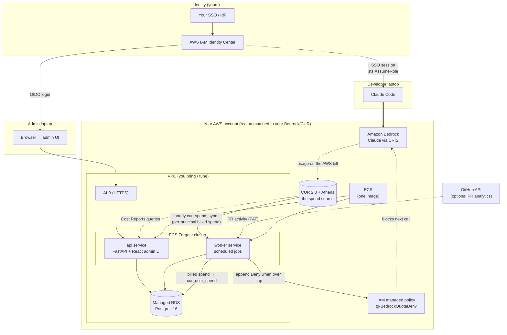

# Token Governance — Architecture Overview

How Token Governance (TG) is shaped, how it attributes and caps
per-user Bedrock spend, and what it takes to run it in your own
AWS environment. Written for an architect or admin evaluating or
operating TG.

The deployment specifics (ECS) are covered in the second half;
the first half is the system model regardless of where it runs.

---

## The one-paragraph model

Developers use Claude Code against Amazon Bedrock with **their
own SSO identity** — no new keys, no proxy in the request path.
TG sits **out-of-band**: a worker reads **billed spend from AWS
Cost and Usage Report (CUR 2.0) via Athena** — the sole spend
source — into Postgres per user, and when a user's billed spend
exceeds their cap it appends a per-user `Deny` to an IAM policy so
the next call is blocked at IAM. An admin UI (served by the app)
manages caps, pricing, and users. The whole system is **two
containers + a database**.

---

## 1. What am I actually deploying?

**Two microservices off a single container image**, behind an
ALB, backed by Postgres:

- **api** — FastAPI. Serves the **admin UI** (React, baked into
  the image) and the `/api` backend.
- **worker** — a scheduled job runner (APScheduler). Its core job
  syncs billed spend from CUR 2.0 via Athena (hourly) into Postgres
  per user, and drives quota enforcement. (Full job list in §13.)

Both run from the **same image** as two ECS services with
different start commands.

## 2. How many images do I build?

**One.** The admin UI is bundled into the api image; it is *not*
a separate frontend container. There is no other artifact — admins
use the web login (the bundled admin UI), not a downloaded client.
So: one image → ECR → two ECS services.

## 3. What infrastructure does this need?

| Layer | What it is | Who provides it |
|-------|-----------|-----------------|
| **VPC + subnets** | 2 public + 2 private, NAT, IGW | **You** (bring-your-own recommended) |
| **ALB** | HTTPS entry to the api service | You (tune to your standards) |
| **ECS cluster + Fargate** | runs api + worker tasks | You |
| **ECR** | holds the one image | You (you already have ECR) |
| **Postgres** | app state + spend | **Managed RDS** (ours) or your existing DB — not a container (see §4) |
| **ACM cert + DNS** | TLS for the ALB | You (existing cert/domain) |
| **CUR 2.0 + Athena** | Cost and Usage Report export + Glue + Athena workgroup | One-time deploy (`tg-cur-athena`) — **this is the spend source** |
| **IAM roles** | developer assume-role + quota-deny policy | TG app stack |

Our reference `tg-container-stack` *can* create the VPC/ALB/RDS,
but in an enterprise account you'll typically **bring your own**
and pass them in as parameters (`ExistingVpcId` +
`ExistingSubnetIds`).

**BYO-VPC subnet requirements.** The Fargate task pulls its
image from ECR and reads the DB password from Secrets Manager
*at task start*, so the subnets you pass must give the task a
path to **Secrets Manager + ECR (api & dkr) + CloudWatch Logs**.
Supply **≥2 subnets across ≥2 AZs** (the RDS + ALB floor), all
of one egress type:

- **all public** (route to an IGW) — the task gets a public IP
  to reach those services; or
- **all NAT-routed private** (default route to a NAT gateway); or
- **all private with no NAT** — only if the VPC has **interface
  VPC endpoints** for `secretsmanager`, `ecr.api`, `ecr.dkr`,
  and `logs`.

Don't mix egress types across the set — one `AssignPublicIp`
value applies to every task ENI. The installer's pre-flight
classifies the subnets, picks `AssignPublicIp` accordingly, and
**fails loud** before deploy if the chosen subnets can't reach
those services (a public-subnet-without-public-IP combination
silently breaks task startup otherwise).

## 4. Is Postgres a container too? (local vs ECS)

This is the one thing that differs by environment:

| | **Local (docker-compose)** | **ECS (your deployment)** |
|---|---|---|
| What Postgres is | a `postgres:16` **container** with a `pgdata` volume | a **managed RDS** Postgres 16 instance (`db.t4g.micro` by default) |
| Run by | docker-compose, alongside api/worker | AWS RDS, in its own subnet group + security group |
| How api/worker reach it | `DATABASE_URL` to the compose service | `DB_HOST` = the RDS endpoint; password from Secrets Manager |
| Backups | none (use the `pg_backup` job → S3) | **RDS automated backups + PITR** (the `pg_backup` job is redundant here — see §13) |

So on **ECS there is no Postgres container** — the only
containers in the ECS task are **api** and **worker**. The
database is managed RDS (or your own existing Postgres if you
point the app at it). The local compose Postgres is for
development only.

## 5. Do my developers need AWS keys or a new login?

**No new keys.** In the common setup, **your SSO → IAM Identity
Center**: a developer's existing SSO session does `sts:AssumeRole`
into a Bedrock role and calls Bedrock directly — no extra
credentials to mint, no per-user provisioning. Token Governance is
principal-agnostic, though: if your developers reach Bedrock as IAM
users or machine roles instead, those are governed the same way. (We
need to confirm your IdP specifics — see the questions list.)

## 6. How is per-user spend tracked?

**One source: AWS Cost and Usage Report (CUR 2.0) — the
authoritative dollar figure on your AWS bill.** There is no
estimate-from-logs layer; CUR is the sole spend source.

The worker's `cur_spend_sync` job queries CUR via **Athena**
hourly on the `line_item_iam_principal` column (each developer's
session name is their email, so cost attributes per-user
natively) and writes per-user billed `spend_usd` + token counts
to the Postgres `cur_user_spend` table. The deny reconciler reads
those billed totals and appends a per-user `Deny` when month-to-
date spend exceeds the cap. The admin UI shows the same CUR-sourced
numbers; the Cost Reports page runs the saved Athena queries
directly.

> **In short:** spend is the **true cost** from the AWS bill (CUR
> 2.0 via Athena), synced hourly into Postgres. Because CUR is
> billing data, it lags the AWS bill by **≤24h** — caps enforce on
> billed spend, not a real-time estimate.

## 7. What's the Cognito pool for? Do I need it?

It's the **always-on base login** for the admin UI — a Cognito
user pool the installer deploys, so admins can sign in even before
(or without) wiring your own IdP. Since you use IAM Identity
Center, you can add OIDC/SAML federation to your IdP later through
the admin UI; until then, the Cognito pool is the login. Either
way, the admin entry point is the **web login** in a browser.

## 8. How does quota enforcement actually block a user?

The worker appends a per-user `Deny` to a managed IAM policy
(`tg-BedrockQuotaDeny`) scoped by `aws:userid` (the session), so
an over-cap user's next Bedrock call is denied at IAM until the
cap resets. No proxy in the request path — enforcement is in IAM,
not inline.

## 9. What region(s)?

Claude Code runs against Bedrock through a **cross-region
inference profile (CRIS)** — the region/geo can be US, EU, APAC,
etc., matched to your account. The model *names* are Claude
Sonnet / Haiku / Opus; the CRIS profile ID carries the geo
prefix for your region. Note that CUR 2.0 and the CRIS
model IDs are region-specific, so we align the deployment region
with where your Bedrock access (and CUR export) live
(e.g. us-east-1 in our reference, but not a requirement).

## 10. How do admins sign in?

Through the **web login** in a browser — there is no separate
admin client to download. The api service serves the admin UI; an
admin opens the ALB URL and authenticates via:

- the **Cognito** user pool the installer deploys (the always-on
  base login — works with no IdP setup), or
- your own **OIDC/SAML IdP** (e.g. Okta), wired through the admin
  UI when you're ready.

Either way it's a normal browser session — same admin UI, same
features. (An earlier `tg-admin` desktop client was retired; the
web login is the only admin entry path.)

## 11. What do I build vs. what does TG provide?

- **You build:** VPC/subnets/ALB/cluster per your standards; push
  the one image to your ECR; provide cert/domain, Postgres
  endpoint (or let us create RDS), and (optionally) your
  CUR/Athena coordinates.
- **TG provides:** the container image, the CFN for the app
  (ECS services, task defs, IAM roles, quota-deny policy), the
  worker job suite, and the admin UI.

## 12. What's the fastest way to de-risk the first deploy?

Run the install against your **Bedrock playground account**
following INSTALL.md end-to-end. It surfaces the real answers to
the identity/networking/CUR questions faster than any spec
review.

## 13. What does the worker retrieve, and from where?

The worker is a scheduled job runner. Every job is **out-of-band**
— none of them sit in the Bedrock request path. The integrations:

| Job | Cadence | Reads from | Writes to |
|-----|---------|-----------|-----------|
| **cur_spend_sync** | hourly | **Athena → CUR 2.0** on `line_item_iam_principal` | per-user billed `spend_usd` + tokens in Postgres `cur_user_spend` |
| **deny_reconciler** | 5 min | Postgres (who's over cap) | IAM `tg-BedrockQuotaDeny` (add/remove Deny) |
| **quota_monitor** | 15 min | Postgres | alert state (threshold emails) |
| **quota_reset** | daily + monthly | Postgres | resets per-user counters |
| **github_sync** | 10 min | **GitHub API** (PR activity; needs a PAT) | `github_activity` in Postgres |
| **pr_classify** | 30 min | Postgres (synced PRs) | PR classifications |
| **pg_backup** | daily 03:00 UTC | Postgres | `pg_dump` → S3 (**optional; redundant on RDS** — leave `PG_BACKUP_BUCKET` unset and rely on RDS automated backups) |

Plus the **api** queries **Athena → CUR 2.0** on demand for the
Cost Reports page (§6).

The external integrations a customer cares about:
- **CUR 2.0 → Athena** — the billed usage/spend signal for quotas
  (synced hourly by `cur_spend_sync`). **Core — the sole spend
  source.**
- **GitHub → worker** — *optional* PR velocity/cost analytics;
  needs a GitHub PAT in admin settings. If unused, the job
  no-ops gracefully — no GitHub dependency for core governance.

---

## Deployment architecture (reference)

**Key property:** governance is **out-of-band**. Developers call
Bedrock directly; nothing sits inline in the request path. Spend
is the **true cost** from the AWS bill — CUR 2.0 via Athena, the
sole spend source, synced hourly into Postgres and used both to
enforce caps and to drive the admin UI / Cost Reports. There's no
gateway to scale or keep highly available.
