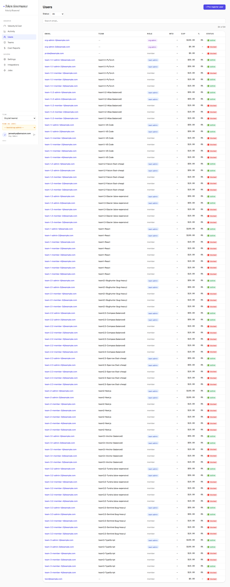
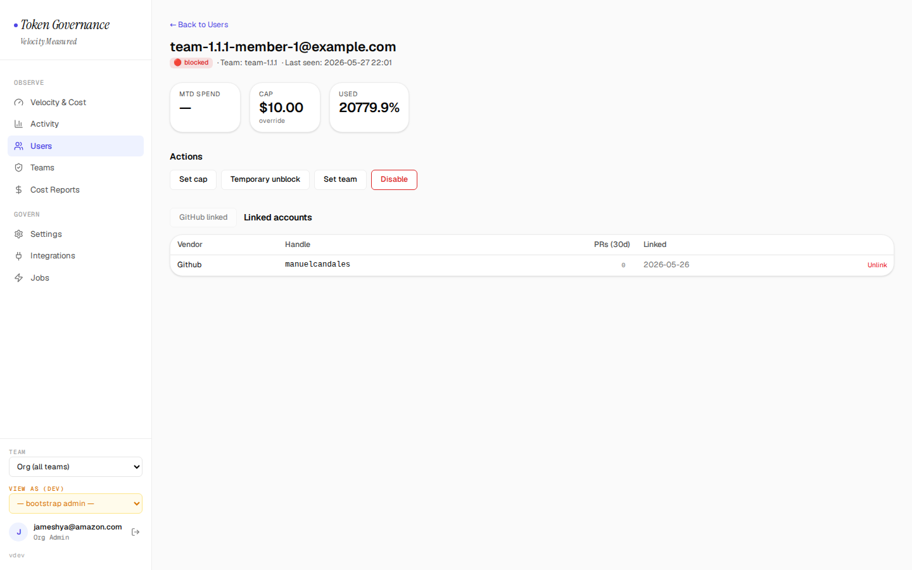
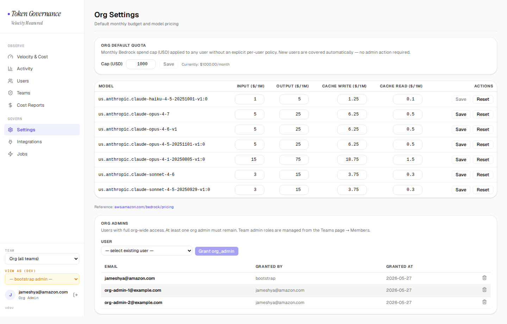
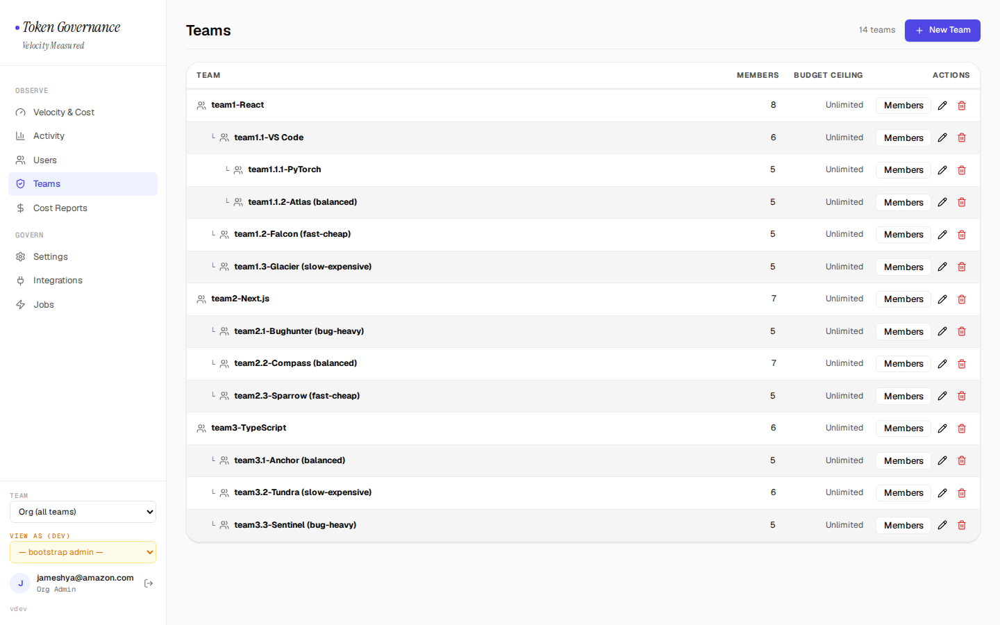
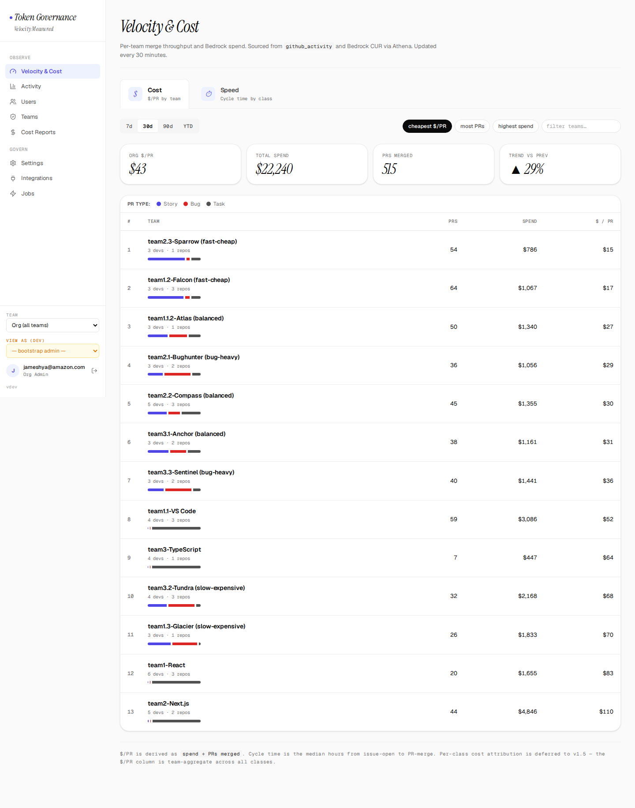
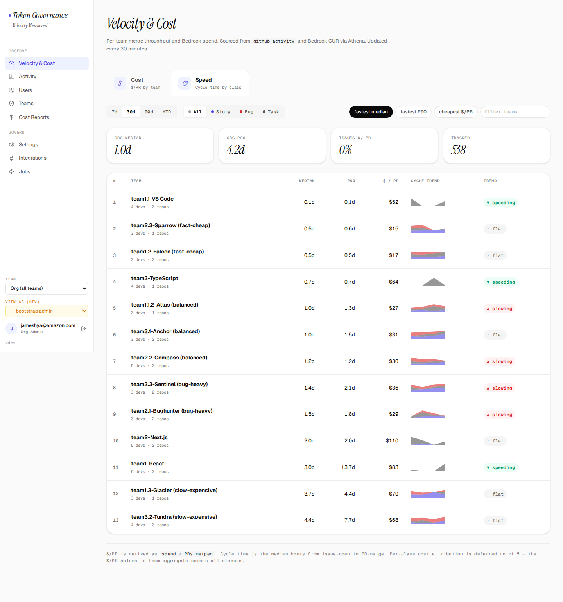
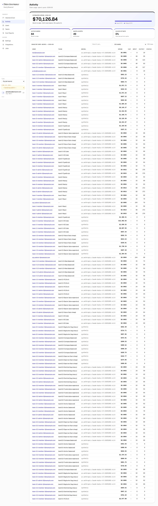

# Token Governance — See it in action

**Claude Code on Bedrock, at full speed — with spend on rails.**

Your developers ship faster with AI. Finance wants to know what
it costs. Security won't allow new logins or access keys. Token
Governance gives you all three: real per-developer cost, hard
spend caps, and zero new credentials — running entirely in your
AWS account.

Here's what it looks like.

---

## 💰 Per-user spend, automatically

Every developer's Bedrock spend, attributed to them by name — no
tagging, no per-user setup. Caps, % used, and status at a glance.

Drill into anyone: their spend, their cap, their team — and one
click to raise the cap, pause, or unblock.

---

## 🛡️ Spend caps that actually stop overspend

Set a monthly dollar cap. Go over, and the next call is blocked
at the IAM layer — no proxy, nothing inline, nothing to slow
developers down. Under cap? They never notice it's there.

Set an org-wide default once. New developers are covered
automatically — no admin action required.

---

## 👥 Teams, the way your org is shaped

Nested teams, budgets per team, spend that rolls up the
hierarchy. Mirror your real org structure in minutes.

---

## 📈 Velocity *and* cost — together

The question every leader asks: are we getting value for the
spend? See cost-per-PR by team, and the PR mix behind it.

And the other half — how *fast* each team ships. Cycle time,
trends, who's speeding up.

---

## 🔎 Full activity, always on

Every invocation, every dollar, in one feed. Nothing hidden.

---

## Why teams choose Token Governance

- **No new logins.** Works with your existing identity setup —
  SSO / IAM Identity Center, IAM users, or machine roles. No new
  Okta app, no extra credentials to mint.
- **Nothing in the request path.** Developers call Bedrock
  directly — no gateway to scale, secure, or keep up.
- **Real cost, not estimates you can't trust.** Per-user spend
  from the source, reconcilable against your AWS bill.
- **Caps that hold.** Enforcement at the IAM layer, not a
  best-effort dashboard warning.
- **Runs in your account.** Two containers + a database. Your
  data never leaves.
- **Velocity, governed.** Tie spend to shipped work — prove the
  ROI of AI coding.

---

**[→ How it works (architecture)](architecture.md)** ·
**[→ Install](../INSTALL.md)**
